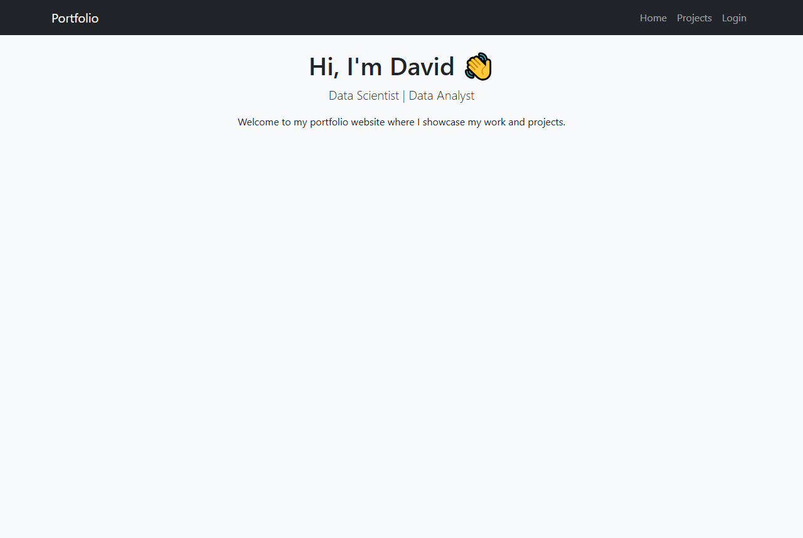

# 🖥️ Flask Portfolio Website

A personal portfolio website built with **Flask** and **Bootstrap** where I can showcase my projects, upload new ones, and share contact details.

---

## ✨ Features
- Brief homepage 
- Upload form (only I can upload new projects)  
- Secure login with hashed password  
- Supports images, descriptions, and GitHub links for projects  

---

## 🚀 Tech Stack
- **Backend:** Flask (Python)  
- **Frontend:** Bootstrap 5, Jinja2 templates  
- **Database:** SQLite (default, can swap with PostgreSQL/MySQL)  

---

## 📸 Screenshots
### Homepage

### Projects

### Login Page

### Upload Page

---

